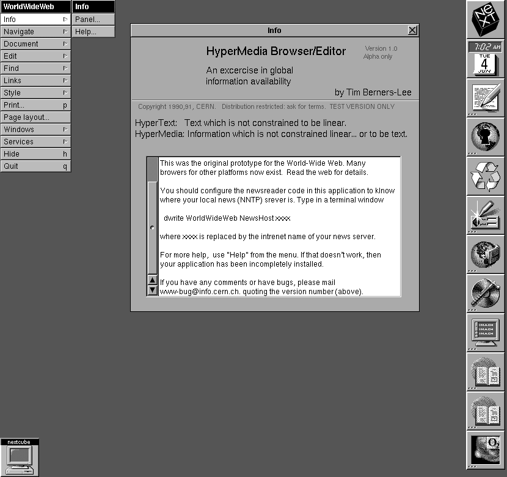

# History of Web-Development (Frontend-Tech)

This is written out of my head. I cannot guarantee that everything is *correct*.

## Epoch 1: When Dinosaurs walked the earth

Back in the 90s, the internet used to be bunch of documents that were linked
together. It was pretty much like Using Mircosoft Word but when you click a
Link, Word would open a different Word file on a different computer.



Actually, **not** a lot has changed. Websites are still files on some computer
but with additional processing (see below) such that we can have dynamic websites. 
The websites are commonly written in `HTML`. 

## Epoch 2: LAMP Stack 

In the mid 90s, new technology arrived with the rise of **Linux** as free
operating system, **Apache** as (still) very popular and free webserver,
**MySql** as another very popular database solution and finally
**Perl/Python/Python** to bring life into the static webpages. Hence, the
name **LAMP**. PHP was the most popular tho (still is somewhat today).
Actually, the LAMP Stack is still very popular today!

The idea from here on is to not only write your page in `HTML` but to insert
`PHP` in various places to make it dynamic. For example, let say I have a
webpage that greets new Users by showing the count of visitors. Previously, this 
was just not possible, because we would have to *manually* update the stupid 
HTML file everytime someone visits the website... Now, we just place some php 
into the file and it will magically get the right `VisitorCount` from the database.-

```php
<html>
    <?php>
        $VisitorCount = .... // some code to get the visitor count from database 
    <?>
    <body>
        <?php>
            echo 'Hello Visitor number $VisitorCount'
        <?>
    </body>
</html>
```

PHP is well supported by **Apache** web server. What happens is that a User visits the 
website, which essentially is still a stupid document somewhere on a disk, but
this time the webserver will execute the  PHP to change the website before
delivering it to the client. This is what we would call **Server Side Rendering** today
because the **Webserver** renders the HTML for us!

## Epoch 3: Birth of Javascript

Almost at the same time, some people wanted even more ways to ruin the UX with
blinking and moving web banners. This should not be rendered on the Webserver
because of efficiency reasons (*Task: Why?*).

*Hint*: Imagine, I wanted to make a web-banner change background color every 1
seconds.


Therefore, Javascript was mainly used to bring interactivity into the browser of
the user!  Anyway, the creator of Javascript was forced to make a language
similar to Java because in that time Java was the cool kid on the block. 

Here check this out: [Java](https://www.youtube.com/watch?v=RnqAXuLZlaE)

Maybe, on a backend workshop, I may rant about Java.

But he fucked Javascript up so bad that there were tons of people trying to
fix the language over the next decades. Microsoft came up with Typescript in
2012 which makes it finally reasonable to use ~~Javascript~~ Typescript.

An example, why Javascript is stupid. [More
here](https://github.com/denysdovhan/wtfjs#-is-equal-)

```javascript
// this is an easy example, there are much more stupid examples

true == []; // -> false, so true is not an array, understandable
true == ![]; // -> false, okay true is not not an array, still somewhat understandable

false == []; // -> true, WHY???? 
false == ![]; // -> true, WHAT? WHY??
```

The issues with the language is just the tip of the iceberg. Javascript really
set back humanity's progress for some decades (just kidding but there is some
truth to that). 

## Epoch 3: Entering the decade of smartphones

I will just skip from the end of the 90s to to 2010s along with the tech
invented during this period. However, the first smartphones were getting popular
in the 2010s and people wanted to access the internet from a tiny tiny screen.
And thus, we have to make our websites responsive. Not only that, people started
using social media more excessively! 

As you guys know today's social media websites (Youtube, Instagram, Tiktok),
these kind of websites are extremely interactive. There is something constantly
something happening on the webpage and the frontend has to deal with a lot of
data especially media.

So we have this inherent challenge as Frontend Developers:

**If the underlying data of my website changes, how do I update it for the user??**

For example, the instagram feed has to load new posts everytime we scroll and
come close to the bottom of the page. Clearly, we can use Javascript to somehow check 
if we scrolled down to the bottom of the page. But then, what do we do?

*Task: Come up with a Server Side Rendered solution (with minimal JS) and think
about why this is not ideal!*


Well, you will quickly realized that we have a quite complex issue. That is, our
website has some data already loaded (e.g. the posts that we can already see)
and than we will get new data and have to update the website! But we cannot
insert it somewhere *randomly*. The user expect the new data (new posts) to be
at the bottom so that he can continue scrolling! Oh, and what happens if a
friend sents us a message?? Than, the website also has to somehow indicate that!
And what if a friend has a new Reel (I think they are called that??) online?? 
Well, we have to update the app again! And everything has to update at the
correct position too! And then, after you manage to connect your data to the
right update to the right element of your page, your stupid manager comes around
and has the next idea to change the UI. Clearly, we need a solution!

> Data of an app / webpage shall be referred to as the **State** of that app / webpage!

### Facebooks solution: ReactJS, which is not (really) reactive

Similar to the history of Javascript, Facebook had that brilliant idea to solve 
the problem above. They called their solution `React`. Why? Because the idea is
that you should only care about the State of your webpage and the updates to the
view should happen *magically* or in other words *reactively* as in reacting to
changes on the State. For our instagram example, we would in theory simply have
to get the new posts from a data source and `React` will automatically handle
updates to view. I may come to why this is not true later.

But first, we will investigate how `React` works under the hood.

For that, we will introduce the `Virtual DOM` and the `DOM`. The `DOM` is a
data representation for our website. You guys surely know some HTML. HTML
consist of elements that look like this

```html
<some_name>...</some_name>
```

A website in HTML consist of these elements in a nested fashion. Back to the PHP example
that may look like this on our browser. 

```html
<html>
    <body>
        Hello Visitor number 69
    </body>
</html>
```

The `DOM` tries to capture this HTML internally so it is nothing you can touch
or see per see, it is not that HTML, it is not the page you see in the browser.
It's JUST the internal data representation! (It's okay if you dont understand
it).

What React does it, it makes an abstract copy of that `DOM` called a `Virtual
DOM` or `VDOM`. With that in mind, React starts to operate on the `VDOM` - again
JUST internal data representation. They add internal functions on how to *convert* 
changes on that `VDOM` to the `DOM` which than updates the HTML we can see!

So, How do we Programm that `VDOM`? That is, how do we update the State such
that React knows how to update `DOM` properly? This will be answered in the
chapter about React Basics!

One thing to note here tho: We just started to render on the client/browser! We
do not let the webserver change the HTML but we change the HTML with React in the
browser of our User! This is also called *Client-Side-Rendering*.

## The Future?

Yeah, nobody really knows how Frontend Tech will develop. BUT it seems like we
are going back to the 90s because server side rendering gets more popular right
know. This is because React makes website SLOW af (big ass javascript has to be 
download on webpage load). Hence, many apps now go some "hybrid" path and render
the important stuff on the server while letting the client render some stuff
once the page is interactive! 